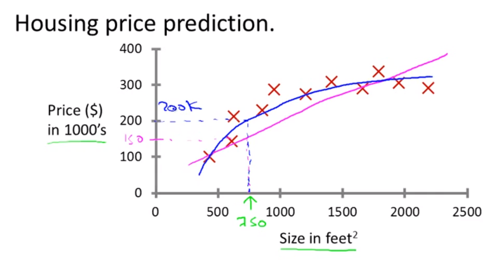
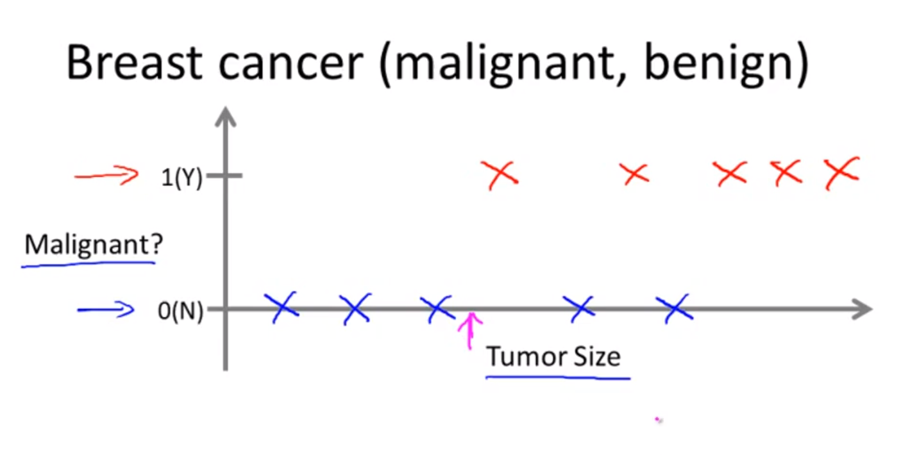

# 머신 러닝

## 머신러닝
- 인공지능 분야에서 파생  
- 컴퓨터의 새로운 기능을 위해  

EX)  
- Database mining  
    자동화/웹의 성장으로 인한 대규모 데이터셋  
    웹클릭, 의료기록, 생물학, 공학  
- 수동적으로 할 수 없는 분야  
    자동화 헬리콥터, 손글씨 인식, 자연어 처리, 컴퓨터 비전  
- self-customizing programs  
    Amazone, Netflix 작품 추천
- Understanding human learning  
    인간이 학습하는 것, 인간의 두뇌를 이해

## 기계학습이란?

Arthur Samuel의 정의  
내용을 분명하게 프로그램하지 않으면서 컴퓨터에게 학습할 능력을 주는 것  

Tom Mitchell의 잘 제한된 학습 문제의 정의  
어떤 과제 T에 대한 성능이 P라고 측정되고, 경험 E를 통해 향상된다면 프로그램은 과제 T에 대해 경험 E로부터 성능 기준 P에 따라 학습한다  

체스 학습의 예에서  
E = 수만번의 게임을 스스로 수행한 경험  
T = 체스를 하느 작업  
P = 다음 체스 게임에서 새로운 상대를 이길 확률

학습 알고리즘의 메인이 되는 두 유형  
1. 지도 학습(supervised learning)  
    컴퓨터에게 무엇을 어떻게 하는지 가르치는 것
2. 자율 학습(unsupervised learning)  
    컴퓨터에게 스스로 배우라고 시키는 것  

강화 학습, 추천 시스템 등도 있다  

## 지도 학습

알고리즘에게 데이터 집합을 주는데 정답이 정해져 있는 것  
알고리즘의 역할은 '정답'을 더 많이 만들어 내는 것이다.
  
데이터를 직선에 맞출지 이차 곡선에 맞출지에 대한 판단을 어떻게 내려야 되는지  

### 회귀 문제 (Regression problem)
연속된 값을 가진 결과를 예측하려 하는 것(Ex 가격)

### 분류 문제 (classification problem)
0 또는 1, 악성 또는 양성과 같이 불연속적인 결과값(Discrete value)을 예측하려 하는 것  
결과가 두 개 보다 많은 종류가 있을 수 있다

## 자율 학습
데이터가 주어지고 데이터가 무슨 의미인지 주어지지 않는다  

### 클러스터링 알고리즘 (Clustring algorithm)
데이터를 분석해서 특성이 비슷한 데이터 끼리 분류하는 알고리즘  

Unsupervised learning 혹은 Clustering이 응용되는 곳  
Clustering의 예  
대규모 컴퓨터 클러스터 구성  
소셜 네트워크 분석  
시장 부분화  
천문학 데이터 분석  

Non-Clustering의 예  
칵테일 파티 문제  
멀리 떨어진 마이크 두개에 녹음된 두명의 소리를 분석하는 알고리즘을 작성  
혼란스러운 환경에서 구조를 찾을 수 있게 해준다  
두 개의 멀리 떨어진 마이크에 두 명의 사람들의 목소리가 녹음되어 있다 이 소리들은 추가되거나 서로 합쳐지고 섞이게 되고 알고리즘은 이 섞인 녹음 파일에서 2개의 오디오 소스를 분리한다  
[W,s,v] = svd((repmat(sum(x.*x,1),size(x,1),1).*x)*x');  

svd는 선형대수를 이용한 특이값 분석 Octave를 이용해 구현 가능하다  
Octave를 이용해 알고리즘을 구성하고 다른 언어로 이식하면 빠르게 구현 가능  
